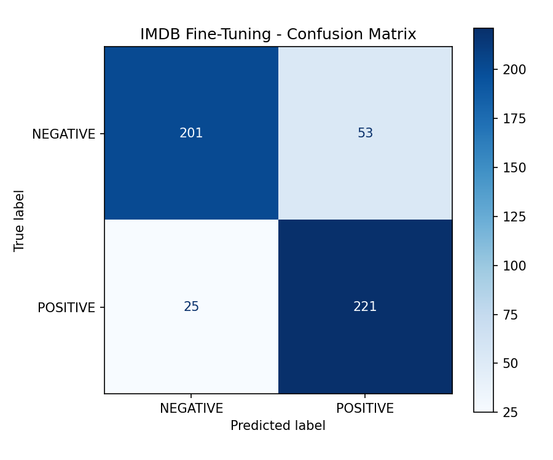
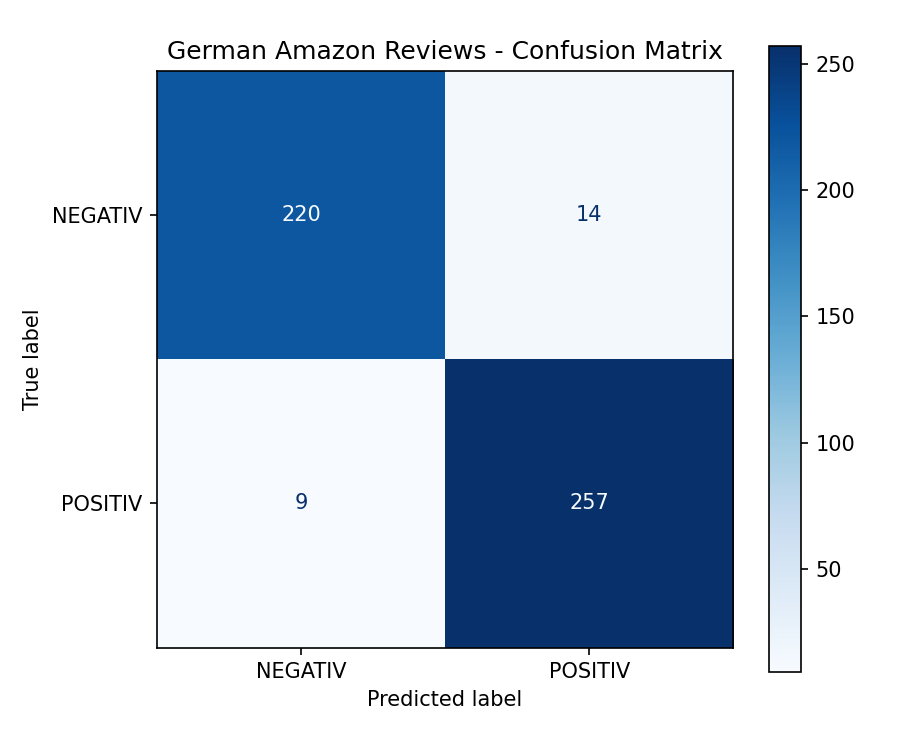
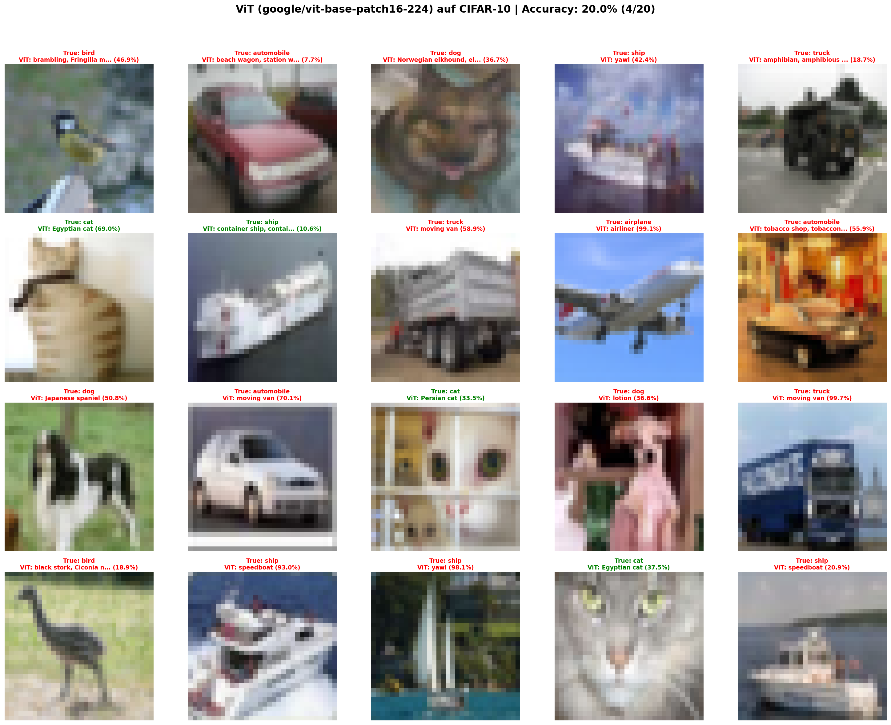
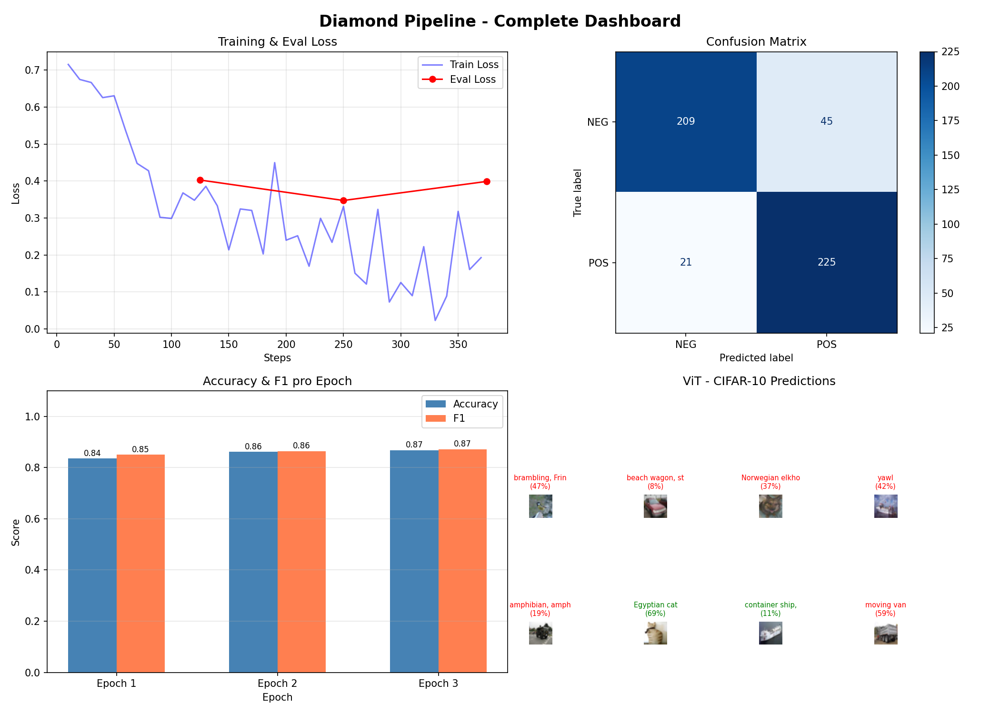

# Hugging Face Fine-Tuning: German Sentiment & Vision Transformer

Fine-Tuning von Transformer-Modellen fuer **deutsche Sentiment-Analyse** und **Bildklassifikation (ViT)** mit dem Hugging Face Ecosystem.

## Ergebnisse

| Aufgabe | Daten | Model | Accuracy | F1 |
|---------|-------|-------|----------|----|
| IMDB Sentiment | 500 Reviews | DistilBERT | 84% | 85.0% |
| Amazon DE (Silver) | 2.000 Reviews | gbert-base | **95%** | **95.7%** |
| Diamond Pipeline | 1.000 Reviews | DistilBERT | 87% | 87.2% |
| ViT CIFAR-10 | 20 Bilder | vit-base-patch16 | 20% exakt / ~80% semantisch | - |

## Projektstruktur

```
01_datasets_erkunden.py          # 3 Datasets laden & analysieren (IMDB, Amazon DE, Multilingual)
02_finetuning_imdb.py            # Fine-Tuning DistilBERT auf IMDB + Confusion Matrix
03_eigenes_dataset.py            # Eigenes deutsches Dataset (24 Restaurant-Reviews) + gbert-base
04_verstaendnis.py               # 6 Verstaendnisfragen mit Antworten
05_bronze_model_vergleich.py     # 4 Sentiment-Models im Vergleich auf Deutsch
06_silver_german_finetuning.py   # Fine-Tuning gbert-base auf 2000 Amazon DE Reviews (95% F1)
07_gold_vit.py                   # Vision Transformer auf CIFAR-10 + Label-Mismatch-Analyse
08_diamond_pipeline.py           # End-to-End Pipeline: Training, Eval, Curves, ViT, Dashboard
ABSCHLUSSBERICHT.md              # Ausfuehrlicher Projektbericht
```

## Visualisierungen

| Confusion Matrix (IMDB) | Confusion Matrix (German) | ViT CIFAR-10 | Diamond Dashboard |
|:---:|:---:|:---:|:---:|
|  |  |  |  |

## Zentrale Erkenntnisse

- **Sprache matters:** Ein englisches Model (DistilBERT-SST2) erreicht auf deutschen Texten nur 50% -- nicht besser als Zufall
- **Daten sind der Schluessel:** 24 Texte -> ~60%, 500 -> 84%, 2.000 -> 95% Accuracy
- **Label-Granularitaet:** ViT erkennt "airplane" als "airliner" (99% Konfidenz) -- semantisch korrekt, aber String-Mismatch zwischen ImageNet-1k (1.000 Klassen) und CIFAR-10 (10 Klassen)

## Setup

```bash
git clone https://github.com/SebastianKuehnrich/hf-finetuning-german-sentiment.git
cd hf-finetuning-german-sentiment
python -m venv .venv
.venv\Scripts\activate       # Windows
pip install -r requirements.txt
```

## Requirements

```
torch>=2.1.0
transformers>=4.36.0
datasets>=2.16.0
scikit-learn>=1.3.0
numpy>=1.24.0
matplotlib>=3.8.0
accelerate>=1.1.0
```

## Tech Stack

| Komponente | Technologie |
|------------|-------------|
| Deep Learning | PyTorch + Hugging Face Transformers |
| Datasets | Hugging Face `datasets` |
| Evaluation | scikit-learn (Accuracy, F1, Confusion Matrix) |
| Visualisierung | Matplotlib |
| Hardware | CPU (kein GPU erforderlich) |

## Ausfuehren

```bash
python 01_datasets_erkunden.py
python 02_finetuning_imdb.py
# ... usw. bis
python 08_diamond_pipeline.py
```

Die Dateien bauen aufeinander auf (01-04 Grundlagen, 05-08 Challenges).

---

*Alle Ergebnisse sind reproduzierbar mit Seed=42.*
